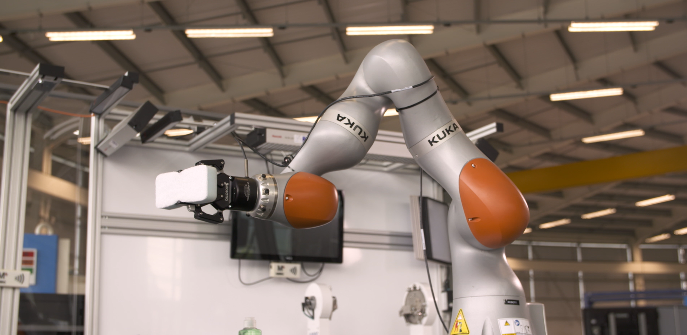
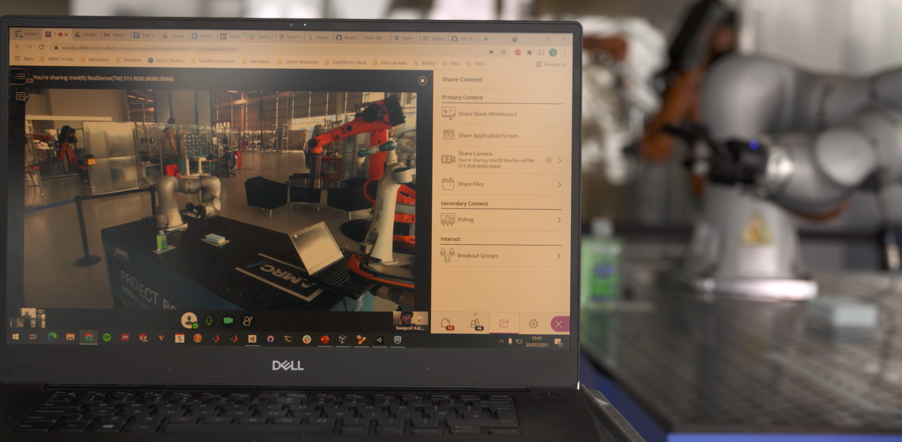

# UK-RAS Manufacturing Robotics Challenge

The software respository for the RAS Challange held at the AMRC in June 2019.

Background:
Industrial robots have been deployed in dull, dirty or dangerous applications for several
decades. However, due to their dexterity and problem solving skills, human operators are
invaluable in the manufacture, maintenance and repair of highly complex products. In order
to keep UK manufacture competitive there is a need to help these operators work effectively.
It is suggested this need could be fulfilled by robotics and autonomous systems.
Brief:
Develop a robotic system to pass an operator tools or components from a based on verbal
commands and provide visual feedback of the robots intention to allow safe collaboration.
Summary of challenges:
1. Human Interface: This challenge demands the implementation of interpretation of
verbal commands using natural language processing.
a. Change keyword to begin speech interface
b. Ask robot to pass items/tools to user; manipulate/position objects
2. Instrumentation: This challenge aims to identify objects and generate grasping
strategies using machine vision.
a. Known named objects from known locations
b. Known named objects from unknown locations on a flat surface using
machine vision
c. Known un-named objects from unknown locations
3. Robot Control Challenge:
a. Point-point
b. Obstacle avoidance
c. Dynamic path planning
4. Digital Twin interface: This challenge involves the visualisation of the real robot
movement using augmented reality. Teams to be creative
5. Integration Challenge: This involves the integration of the 4 previous challenges to
work as one single project.
Additional:
Teams will be provided with a KUKA iiwa robot equipped with a gripper, microphone,
camera, and tray of parts. The robot will be integrated to allow safe operation but will require
programming through ROS.

# Instruction to run the robot simulation:

1. Ensure that ROS Master is running by typing `roscore` in the new terminal window.
  The terminal window can be opened using `Ctrl + Alt + t`
2. Once the roscore is up and running open the new terminal window (`Ctrl + Shift + t`) and type the following `roslaunch iiwa_moveit moveit_planning_execution.launch`. This runs the simulation of the robot and the bench setup as default. If you wish to see the 'pick and place' demonstration with the actual robot, use this command: `roslaunch iiwa_moveit moveit_planning_execution.launch sim:=false`
3. After a few seconds, the new window with **Rviz** and **Gazebo** should be opened. **Rviz** is a scene visualization tool, which displays the robot you are going to control and the scene in which the robot is set. **Gazebo** is a simulation of the actual robot - any paths planned in **Rviz** will be shown in **Gazebo** (providing the path was valid)
4. The `Pick and Place` demo script can be run using the following command (in a new terminal window) `roslaunch pick_place pick_place.launch`. At the current stage, the script is still being edited, hence the movement of the robot may or may not be shown. The instruction on how the script works will appear shortly.
